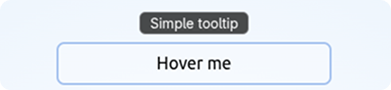

# 💬 Toolpop

💬 **Toolpop** is a lightweight Vue 3 `v-pop` directive for reactive tooltips and simple HTML/image popovers.

[Demo](https://toolpop.jsonkody.cz) | [Live Demo on StackBlitz](https://stackblitz.com/github/JsonKody/toolpop_demo?file=src%2FApp.vue)



## ✨ Features

- 🎁 Tiny Vue 3 tooltip directive with only one runtime dependency: [@floating-ui/dom](https://www.npmjs.com/package/@floating-ui/dom)
- 📐 Smart positioning, flipping, and shifting powered by [Floating UI](https://floating-ui.com)
- ⚡ Reactive tooltip values: strings, refs, computed values, and functions
- 🧩 Optional raw HTML/image mode via `.html`
- 🖱️ Desktop hover/focus behavior by default
- 📱 Touch-device behavior is explicit via `.touch` or `.click`
- 🎨 Fully customizable tooltip appearance

---

## 🚀 Installation

With **pnpm**:

```sh
pnpm add toolpop
```

With **npm**:

```sh
npm install toolpop
```

---

## 🔥 Quick Usage

```vue
<template>
   <p v-pop="'Simple tooltip'">
      Hover me
   </p>

   <button v-pop="`Count is ${count}`" @click="count++">
      Counter: {{ count }}
   </button>

   <button v-pop:bottom-start="'Aligned to start'">
      Bottom start
   </button>

   <button v-pop.click="'Opens on click or tap'">
      Click tooltip
   </button>

   <button v-pop.touch="'Desktop hover/focus, mobile tap'">
      Touch fallback
   </button>

   <p v-pop:right.html="image_tooltip">
      HTML image tooltip
   </p>
</template>

<script setup lang="ts">
import { ref } from 'vue'

const count = ref(0)

const image_tooltip = ''
</script>
```

---

## 🧩 Register as Plugin

```ts
// main.ts
import { createApp } from 'vue'
import Toolpop from 'toolpop'
import App from './App.vue'

const app = createApp(App)

app.use(Toolpop)

app.mount('#app')
```

With custom options:

```ts
app.use(Toolpop, {
   color: 'white',
   backgroundColor: 'rgba(0, 0, 0, 0.85)',
   fontSize: 16,
   borderRadius: 8,
})
```

---

## ✒️ Register as Directive

```ts
// main.ts
import { createApp } from 'vue'
import { createPop } from 'toolpop'
import App from './App.vue'

const app = createApp(App)

app.directive('pop', createPop())

app.mount('#app')
```

With custom options:

```ts
import { createPop, type PopOptions } from 'toolpop'

const options: Partial<PopOptions> = {
   fontSize: 16,
   paddingX: 10,
   paddingY: 4,
   blur: 0,
   backgroundColor: 'rgba(0, 0, 0, 0.85)',
}

app.directive('pop', createPop(options))
```

You can rename the directive if you want:

```ts
app.directive('tooltip', createPop())
```

Then use it as:

```vue
<p v-tooltip="'Tooltip text'">
   Hover me
</p>
```

---

## 📍 Placements

You can control placement using directive arguments.

```vue
<p v-pop="'Top by default'">
   Top
</p>

<p v-pop:bottom="'Bottom tooltip'">
   Bottom
</p>

<p v-pop:right="'Right tooltip'">
   Right
</p>

<p v-pop:left="'Left tooltip'">
   Left
</p>
```

Supported base placements:

| Placement | Example |
| :--- | :--- |
| `top` | `v-pop:top="'Text'"` |
| `bottom` | `v-pop:bottom="'Text'"` |
| `left` | `v-pop:left="'Text'"` |
| `right` | `v-pop:right="'Text'"` |

You can also use `start` and `end` alignment:

| Placement | Example |
| :--- | :--- |
| `top-start` | `v-pop:top-start="'Text'"` |
| `top-end` | `v-pop:top-end="'Text'"` |
| `bottom-start` | `v-pop:bottom-start="'Text'"` |
| `bottom-end` | `v-pop:bottom-end="'Text'"` |
| `right-start` | `v-pop:right-start="'Text'"` |
| `right-end` | `v-pop:right-end="'Text'"` |
| `left-start` | `v-pop:left-start="'Text'"` |
| `left-end` | `v-pop:left-end="'Text'"` |

---

## ⚙️ Behavior Modifiers

### Default behavior

```vue
<p v-pop="'Simple tooltip'">
   Hover me
</p>
```

Default tooltips open on:

- hover on devices with real hover support
- keyboard focus via `:focus-visible`

On touch/no-hover devices, default tooltips do **not** open on tap. This avoids accidental mobile tooltip behavior.

---

### `.touch`

Use `.touch` when you want normal desktop hover/focus behavior, but tap behavior on touch devices.

```vue
<button v-pop.touch="'Desktop hover/focus, mobile tap'">
   .touch
</button>
```

Behavior:

| Device | Behavior |
| :--- | :--- |
| Desktop / real hover | hover + keyboard focus |
| Touch / no-hover | tap |

---

### `.click`

Use `.click` when you want click/tap behavior everywhere.

```vue
<button v-pop.click="'Opens on click or tap'">
   .click
</button>
```

Behavior:

| Device | Behavior |
| :--- | :--- |
| Desktop / real hover | opens on click, closes on mouseleave |
| Touch / no-hover | opens on tap, closes on outside tap or Escape |

---

### `.outside`

Use `.outside` with `.click` when the tooltip should stay open until the user clicks outside or presses Escape.

```vue
<button v-pop.click.outside="'Stays open until outside click or Escape'">
   .click.outside
</button>
```

This is useful for more persistent popover-like behavior.

---

### `.html`

Use `.html` when you want to render raw HTML.

```vue
<p v-pop:right.html="image_tooltip">
   Image tooltip
</p>
```

```ts
const image_tooltip = ''
```

`.html` popovers are created on component mount and kept in the DOM hidden via CSS. This helps image and rich-content popovers appear instantly when shown.

> ⚠️ `.html` uses `innerHTML`. Only pass trusted or sanitized HTML.

---

## 🧪 Reactive Values

Toolpop supports plain strings, refs, computed values, and functions.

```vue
<button v-pop="`Count is ${count}`" @click="count++">
   Counter: {{ count }}
</button>
```

```ts
const count = ref(0)
```

The tooltip content updates when the bound value changes.

---

## ✏️ Options

```ts
interface PopOptions {
   fontSize: number
   paddingX: number
   paddingY: number
   duration: number
   fontFamily: string
   color: string
   backgroundColor: string
   borderColor: string
   borderRadius: number
   scaleStart: number
   blur: number
}
```

Default options:

```ts
const default_options = {
   fontSize: 14,
   paddingX: 8,
   paddingY: 0,
   duration: 0.15,
   fontFamily: 'system-ui, sans-serif',
   color: 'white',
   backgroundColor: 'rgba(0, 0, 0, 0.7)',
   borderColor: 'rgba(255, 255, 255, 0.28)',
   borderRadius: 6,
   scaleStart: 0.75,
   blur: 14,
}
```

Custom options:

```ts
import { createPop, type PopOptions } from 'toolpop'

const options: Partial<PopOptions> = {
   fontSize: 18,
   paddingX: 12,
   paddingY: 4,
   blur: 0,
   backgroundColor: 'rgba(0, 0, 0, 0.9)',
}

app.directive('pop', createPop(options))
```

---

## 📁 Local Use

You can also copy `src/pop.ts` into your project and register it manually:

```ts
import { createPop } from '@/directives/pop'

app.directive('pop', createPop())
```

---

## 🌍 Live Projects

- [jsonkody.cz](https://jsonkody.cz)
- [num.jsonkody.cz](https://num.jsonkody.cz)
- [snejk.bekinka.cz](https://snejk.bekinka.cz) (need Twitch account)

---

## 🪪 License

[MIT](https://github.com/jsonkody/toolpop/blob/main/LICENSE) © 2026 [JsonKody](https://github.com/jsonkody)